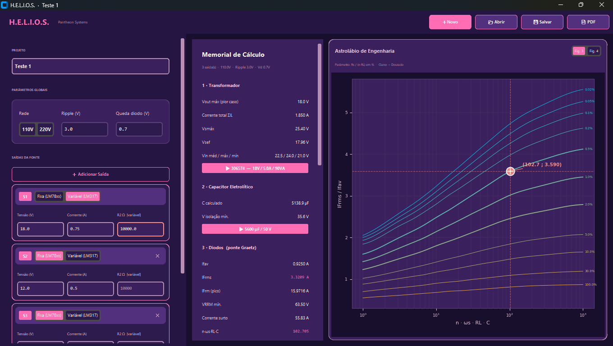
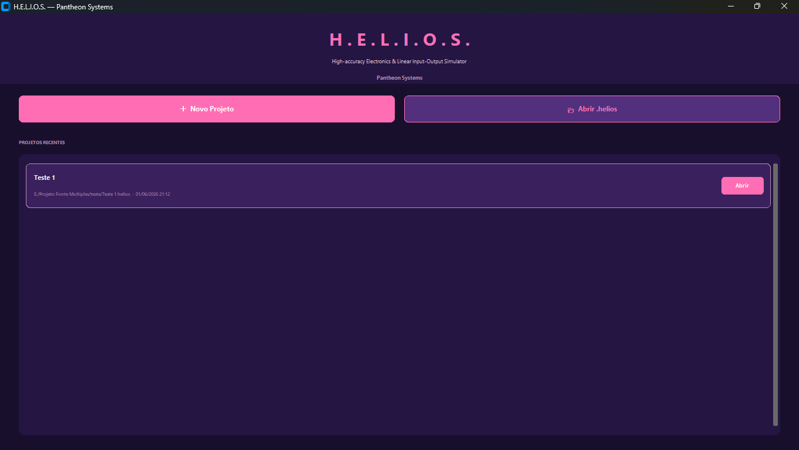
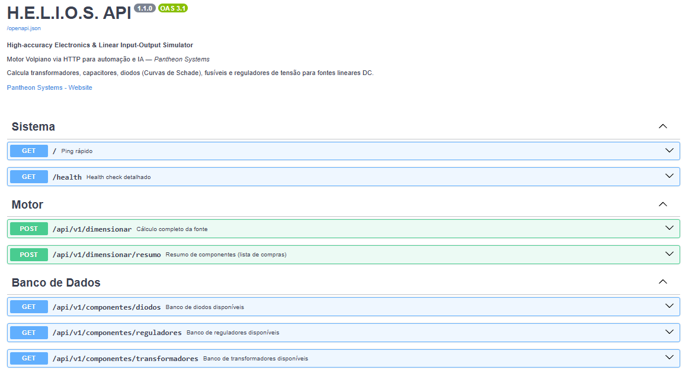

# ☀️ H.E.L.I.O.S.

[](https://www.gnu.org/licenses/agpl-3.0)
[](https://www.python.org/)
[](.)

> **H.E.L.I.O.S.** está em *Gold Release* — projeto funcional e validado, em evolução para um ecossistema de engenharia assistida por IA.

Plataforma de engenharia para dimensionamento, validação e documentação automatizada de fontes lineares reguladas.

Transforma requisitos elétricos em soluções completas: seleciona componentes comerciais reais, valida parâmetros físicos e gera memoriais de cálculo auditáveis — tudo a partir de uma arquitetura desacoplada e reproduzível.

> Núcleo computacional da iniciativa **Pantheon Systems**, projetado para integração futura com o ecossistema **A.R.E.S.**

---

## 🔬 Diferenciais Técnicos

- **Precisão Matemática** — Dimensionamento baseado em metodologias clássicas de projeto, com interpolação das curvas de Schade.
- **Validação Física** — Bloqueio rigoroso de parâmetros fisicamente inconsistentes na entrada (tensões impossíveis, correntes inválidas).
- **Seleção Comercial** — Escolha automática de componentes reais de mercado: transformadores, diodos, reguladores e série E24.
- **Arquitetura Desacoplada** — Separação clara entre Interface Gráfica (Desktop), API REST e Motor Matemático.
- **Reprodutibilidade** — Geração de memoriais de cálculo e memória técnica para auditoria de engenharia.

---

## 🧰 Stack

| Camada | Tecnologia |
| :--- | :--- |
| **Backend & Motor** | Python 3.13 |
| **API REST** | FastAPI |
| **Validação de Dados** | Pydantic |
| **Interface Gráfica** | CustomTkinter |
| **Persistência & Docs** | JSON / Markdown / PDF |

---

## 🖥️ Interface



*Dimensionamento completo com memorial de cálculo e visualização interativa das Curvas de Schade.*



## 🌐 API REST



---

## 📂 Estrutura do Projeto

```text
HELIOS/
│
├── src/
│   ├── calculos/        # Motor de cálculo e Curvas de Schade
│   ├── database/        # Catálogo de componentes comerciais
│   ├── models/          # Schemas Pydantic e validações físicas
│   ├── services/        # Lógica de relatórios e persistência
│   ├── ui/              # Interface gráfica CustomTkinter
│   └── api/             # Endpoints FastAPI
│
├── docs/
│   ├── screenshots/     # Capturas de tela da GUI e API
│   ├── diagrams/        # Diagramas de arquitetura
│   └── reports/         # Memoriais de cálculo de referência
├── tests/               # Scripts de validação e estresse
├── requirements.txt
├── LICENSE
└── main.py              # Ponto de entrada unificado
```

---

## ⚙️ Como Executar

**1. Instalar dependências:**
```bash
pip install -r requirements.txt
```

**2. Interface Gráfica (Desktop):**
```bash
python main.py
```

**3. Servidor da API REST:**
```bash
uvicorn api:app --reload
```

---

## 🛣️ Roadmap

### V1 — Engenharia Profissional *(foco atual)*
- [x] Motor de Cálculo e Interface Desktop
- [x] API REST Base
- [ ] Geração Avançada de Relatórios PDF
- [ ] Exportação/Importação JSON de Projetos
- [ ] Conteinerização (Docker) e Autenticação de API

### V2 — Inteligência Técnica
- [ ] Integração RAG para leitura de datasheets
- [ ] Base de conhecimento eletrônica expansível
- [ ] Memória técnica de projetos anteriores

### V3 — Integração EDA
- [ ] Geração automatizada de Netlists
- [ ] Integração de metadados com KiCad
- [ ] Exportação de modelos de simulação (LTspice)

### V4+ — Simulação e Ecossistema
- [ ] Simulação paramétrica via Monte Carlo
- [ ] Digital Twin com integração IoT
- [ ] Orquestração completa com o ecossistema A.R.E.S.

---

## 📜 Licença

Código-fonte distribuído sob [GNU AGPL v3](https://www.gnu.org/licenses/agpl-3.0). Pode ser estudado, modificado e redistribuído conforme os termos da licença — incluindo a obrigatoriedade de abertura de código para aplicações SaaS.

A marca **H.E.L.I.O.S.**, logotipo, identidade visual e demais ativos da **Pantheon Systems** são protegidos por direitos autorais e não estão cobertos pela licença de software. Veja [`NOTICE.md`](./NOTICE.md) para detalhes.

Copyright © 2026 Matheus — Engenharia de Controle e Automação.